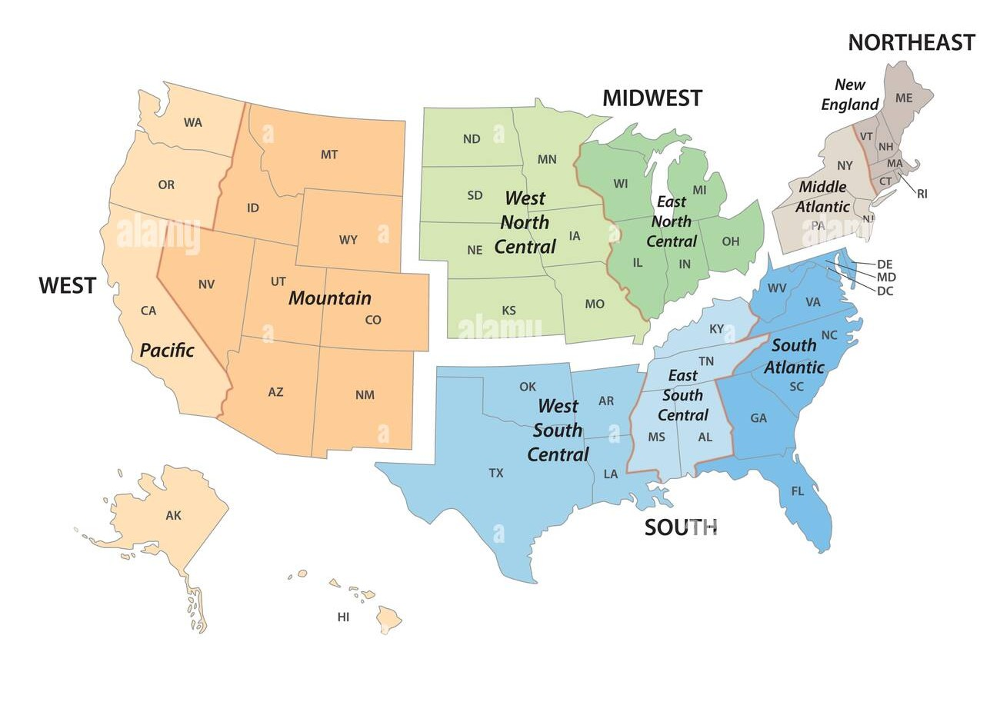

:::::::::::::::::::::::::::::::::::::: questions 

- What kinds of datasets are available from the U.S. Census Bureau?
- How can you visualize and analyze these datasets for your region of interest?
- How do you combine spatial and tabular Census data?
- What variables are available in the ACS dataset?

::::::::::::::::::::::::::::::::::::::::::::::::

::::::::::::::::::::::::::::::::::::: objectives

- Provide an overview of the data available from the U.S. Census Bureau
- Explain how to download and visualize spatial data from the Census Bureau
- Demonstrate how to query and analyze the spatial data
- Demonstrate how to perform complex spatial joins

::::::::::::::::::::::::::::::::::::::::::::::::

## Introduction to Census Data

#### The U.S. Census Bureau provides three broad categories of datasets:

1. Census TIGER/Line Shapefiles
2. Decennial Census of Population and Housing
3. American Community Survey (ACS)

### Census TIGER/Line Shapefiles

TIGER (Topologically Integrated Geographic Encoding and Referencing) is the Census Bureau's primary geospatial data product. TIGER/Line shapefiles are available from 2007 to the present; earlier data is available in ASCII format.

These shapefiles include all legal boundaries and names for geographic units across the United States — *states, counties, places, ZIP codes, urban areas, census blocks, block groups, and census tracts*.
 
Each record includes a standard `GEOID` that links directly to Census demographic data.





TIGER/Line Shapefiles use American National Standards Institute (ANSI) codes to identify geographic entities, including both FIPS (Federal Information Processing Series) and GNIS (U.S. Geological Survey Geographic Names Information System) codes. For example, the field `STATEFP` contains the state FIPS code, and `STATENS` contains the state GNIS code. County-level FIPS codes are five digits: the first two identify the state, and the last three identify the county.


### Decennial Census of Population and Housing

Conducted every ten years, the Decennial Census counts every person living in the U.S. at a single point in time, providing the most complete population data with the smallest margin of error.

#### Variables include:

- **Population:** sex, age, race, Hispanic origin, and household composition
- **Housing:** occupancy, vacancy status, and tenure — available at all geographic levels, including the highest resolution (census blocks)

### American Community Survey (ACS)

The ACS is an annual survey that collects information from a sample of the population. It covers many topics not included in the Decennial Census, such as education, employment, internet access, and transportation. Because it is sample-based, ACS estimates carry a higher margin of error than Decennial Census counts.

#### The ACS is published in two forms:

- **1-year estimates** — based on 12 months of data; available for areas with populations of 65,000+
- **5-year estimates** — based on 60 months of data; available for all geographies, including small areas

#### **Variables include** (in addition to standard demographic and housing data):

##### Social characteristics:

- School enrollment and educational attainment
- Marital status and fertility
- Grandparents as caregivers
- Veteran and disability status
- Language spoken at home

##### Economic characteristics:

- SNAP/Food Stamps participation
- Health insurance coverage
- Income and benefits
- Employment location and commute mode

##### Other:

- Ancestry, citizenship status, place of birth, and year of entry

::::::::::::::::::::::::::::::::::::: keypoints

- Census data supports planning services for specific population groups
- It can be used for business and facility site selection
- It supports public policy analysis
- It enables spatial analysis of hazard impacts, epidemiological models, and more

::::::::::::::::::::::::::::::::::::::::::::::::


---


## Accessing the Census Data 

Before mapping or analyzing Census data, you need to obtain it. The Census Bureau provides several access methods:

- Manual downloads from [data.census.gov](https://data.census.gov/).
- Bulk file downloads
- Programmatic access via the Census API

This lesson focuses on **API-based access**, which lets you retrieve demographic and socioeconomic data directly into Python workflows — without clicking through a web interface.

### What Is a Census API Call?

An API (Application Programming Interface) lets computers request data directly from a server using a structured URL. Census APIs return machine-readable data (JSON or CSV) that can be processed automatically in Python or other tools.

#### Using the Census API, you can:

- Specify exactly which variables you want
- Choose the geographic scale (state, county, tract, block group)
- Automate downloads for reproducibility
- Integrate data directly into scripts and analyses

This approach is especially useful for research, teaching, and large-scale analysis.

### Typical Census API Workflow
 
1. Construct a request URL specifying variables and geography
2. Send the request to the Census API endpoint
3. Receive structured data (JSON or CSV)
4. Convert results into a DataFrame
5. Optionally join data with geographic boundary files for spatial analysis

::::::::::::::::::::::::::::::::::::: callout
 
**Note on Privacy**
 
Census APIs return **aggregate data only**. Individual-level records are never provided, ensuring respondent privacy.
 
::::::::::::::::::::::::::::::::::::::::::::::::

:::::::::::::::::::::::::::::::::::::::::: challenge

### Getting Started with the Census Notebook

Work through the interactive Python notebook linked below, which covers everything on this page hands-on inside Google Colab. More Reading on Census API below!

This part of the session covers:

- **Part 1: Retrieving the Dataset** - You can refer to the theory just below. 

- **Part 2: Exploring the Dataset** - Structures, variables, columns, geographical units.  

### <a href="https://colab.research.google.com/github/SpatialTurn/IGIC2026/blob/main/episodes/CensusDATA_Introduction.ipynb" target="_blank">Open the Notebook in Google Colab.</a>

##### **Note:** After Completion, DO NOT close the notebook. Keep it open as we will use it for the next part of the workshop. 

::::::::::::::::::::::::::::::::::::::::::::::::::::::

---


## Tutorial: Accessing ACS Data via the Census API
 
### Step 1 — Explore the Census API
 
1. Go to the [Census Developers Page](https://www.census.gov/data/developers.html).
2. Click **Available APIs** (left of the search bar).
3. Scroll down and select **American Community Survey (ACS)**.
4. The ACS offers **1-year** and **5-year** estimates. We will use the **2023 ACS 5-Year**, which covers data from 2019–2023.
5. Scroll to **Data Profiles** and review the "Example Call" links — these are the base API URLs you'll use in Python or a browser.
6. Under **Data Profiles**, click the `html` link next to **2023 ACS Comparison Profiles Variables** to browse all available variable codes.

---

 
### Step 2 — Understand API Links for Geographic Levels
 
The ACS API uses different URL patterns depending on the geographic level you want:
 
- Country
- State
- Tract (within a state and county)
For tract-level data, use the `state > county > tract` pattern. Here is an example for **Indiana** (state code `18`):
 
```
https://api.census.gov/data/2023/acs/acs5/profile?get=NAME&for=tract:*&in=state:18&in=county:*&key=YOUR_KEY_GOES_HERE
```

::::::::::::::::::::::::::::::::::::: keypoints

- `tract:*` returns all tracts in the specified state
- `county:*` returns all counties in the specified state
- Replace `state:18` with your state's FIPS code ([State Codes List](https://www.census.gov/library/reference/code-lists/ansi.html#state))
- `state:*` is **not** allowed for tract-level queries due to dataset size limits — you must specify a state
::::::::::::::::::::::::::::::::::::::::::::::::

---

### Step 3 — Add Variables to Your Request
 
1. On the variables page from Step 1, press **Ctrl+F** and search for your variable of interest.  
   Example: searching "no vehicles available" returns variable `DP04_0058E` (the estimate version).
2. Add the variable after `NAME`, separated by a comma:
   **Before:**
   ```
   https://api.census.gov/data/2023/acs/acs5/profile?get=NAME&for=tract:*&in=state:18&in=county:*
   ```
 
   **After:**
   ```
   https://api.census.gov/data/2023/acs/acs5/profile?get=NAME,DP04_0058E&for=tract:*&in=state:18&in=county:*
   ```
 
3. Add additional variables by separating them with commas:
   ```
   get=NAME,DP04_0058E,DP02_0001E,DP03_0062E
   ```

4. Make sure to add the `GEO_ID` column as well.

---
 
### Step 4 — Optional Enhancements
 
- **View variable descriptions:** Add `&descriptive=true` to your URL
- **Download as CSV:** Add `&outputFormat=csv` for a spreadsheet
-friendly file

::::::::::::::::::::::::::::::::::::: callout
 
**Heads up:** API variable names are **case-sensitive** — they must match exactly as listed in the variables page.
 
::::::::::::::::::::::::::::::::::::::::::::::::
 
📺 **Video Tutorial:** [How to Access ACS Data from the Census API](https://www.youtube.com/watch?v=rqePUEBrcWQ)
 
---
 
### Example: Final API Call

**Note:** Make sure to add the API key within the link. 
 
```
https://api.census.gov/data/2023/acs/acs5/profile?get=NAME,GEO_ID,DP04_0058E&for=tract:*&in=state:18&in=county:*&descriptive=true&outputFormat=csv&key=""
```
 
##### This returns the number of occupied households **without a vehicle** for every census tract in Indiana.
 
::::::::::::::::::::::::::::::::::::: keypoints
 
- The Census API gives you flexible, precise access to ACS data
- You can combine multiple variables in a single API call
- `&descriptive=true` adds plain-language descriptions for each variable
- `&outputFormat=csv` makes the data easy to open in Excel or import into Python
::::::::::::::::::::::::::::::::::::::::::::::::