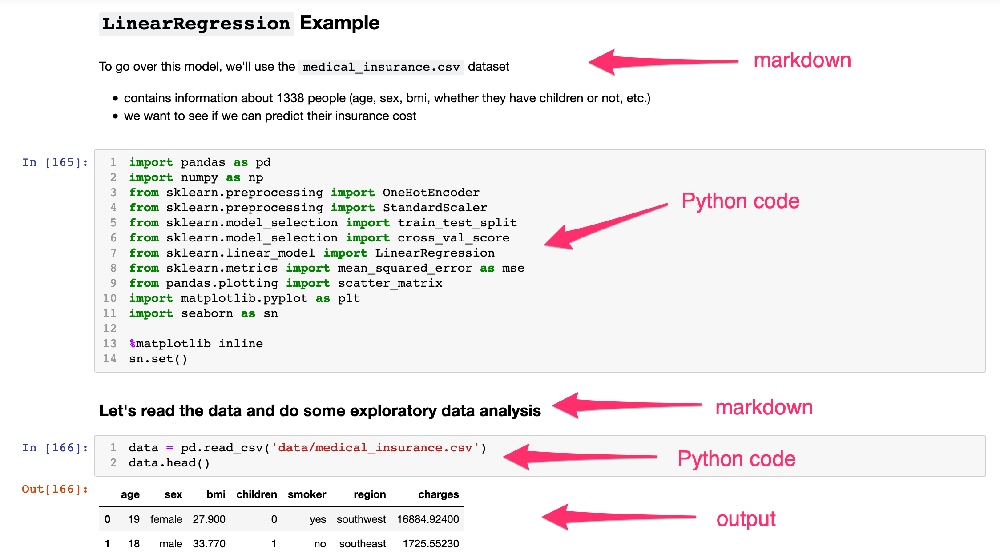
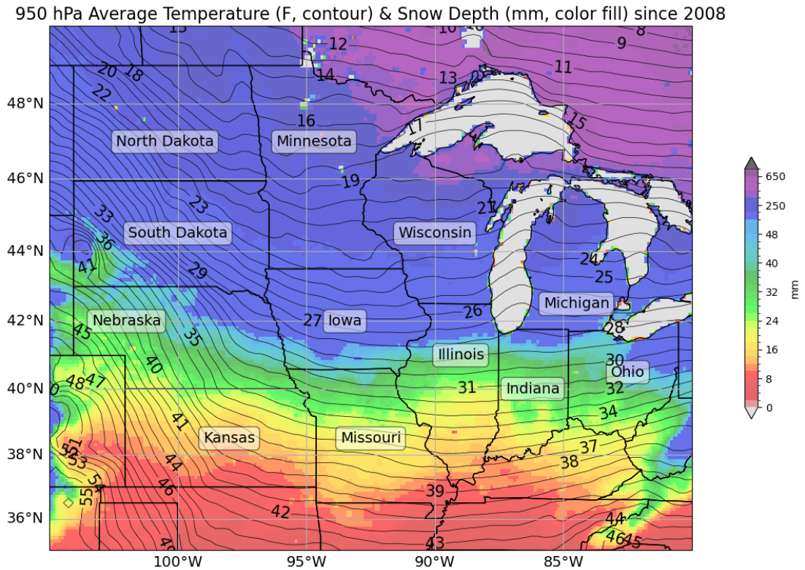
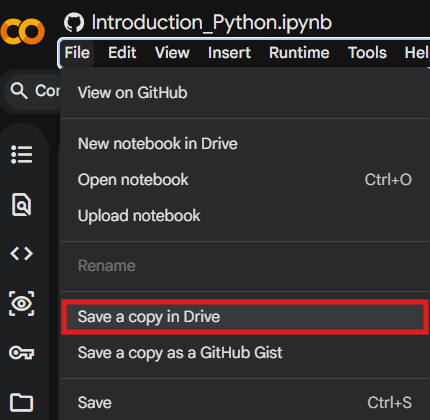

## 1. What Is a Python Notebook?

A **Notebook** is an interactive computing environment that allows you to combine:

- Code (Python)
- Text explanations
- Mathematical equations
- Tables and visualizations
- Results and outputs

All in a single document!

Jupyter Notebooks are especially useful for:

- Data exploration, cleaning, & analysis  
- Teaching and learning Python  
- Prototyping models  
- Sharing reproducible research  

Instead of writing a script and running it all at once, you work in **small, executable blocks called cells**. An example of this would be using the **Notebook** feature in ArcGIS Pro Desktop. 



## 2. Why Data Scientists Use Python Notebooks ?

Python Notebooks support an **iterative workflow**:

1. Write a few lines of code  
2. Run them immediately  
3. Inspect the output  
4. Modify and rerun as needed
5. Move on to next step and repeat!  

#### Key Advantages

- Immediate visualization of data  
- Easy experimentation  
- Built-in documentation using Markdown  
- Reproducible analysis  
- Simple sharing with collaborators  

### An Example: A Plot I made a while Back. 



### The code I used.

```python
cLon, cLat, lonW, lonE, latS, latN = -92.5, 42.5, -105.0, -80.0, 35.0, 50.0 # coordinate extension
proj_data = ccrs.PlateCarree() # setting projection  
proj_map = ccrs.Mercator()
        
res = '10m' # resolution

fig = plt.figure(figsize=(18,9)) # figure parameters
ax = plt.subplot(1,1,1,projection=proj_map)

totalsum = sum(snow[:51]) # finding snow average 
average = totalsum/51 * 1000

totalsum1 = sum([totaltemp[y][0] for y in range(51)]) # total temperature
average1 = (totalsum1/51 - 273.15) * 1.8 + 32 # temperature conversion

bounds = np.concatenate((np.arange(0,52,2), np.arange(50,850,100))) # joining arrays
cmap = mpl.cm.nipy_spectral_r
norm = mpl.colors.BoundaryNorm(bounds, cmap.N, extend='both')

Mesh = ax.pcolormesh(lonstotal, latstotal, average, cmap=cmap, norm=norm, transform=proj_data, alpha=0.6) # choosing color norm
plt.colorbar(Mesh, shrink=.5, extend='both', label='mm')

CL = ax.contour(lontotal,lattotal,average1,levels=np.arange(7,56,1),colors='black', linewidths=0.5, transform=proj_data) # contour temps
plt.clabel(CL,inline=True,fontsize=15)
    
ax.set_extent([lonW, lonE, latS, latN], crs=proj_data)
ax.add_feature(cfeature.COASTLINE.with_scale(res), edgecolor='black', alpha=0.3)
ax.add_feature(cfeature.STATES.with_scale(res), edgecolor='black', alpha=1)

state_names = ['Illinois', 'Indiana', 'Iowa', 'Kansas', 'Michigan', 'Minnesota', 'Missouri', 'Nebraska', 'North Dakota', 'Ohio', 'South Dakota', 'Wisconsin'] # state names
state_coords = {

......... # a lot more lines of code! 
```
#### Those are a lot of lines of code! **Do not PANIC!** We will not be doing this today, thankfully. 

---

## 3. Getting Started: Opening a Notebook

You can use Jupyter Notebooks in several ways, one such way is:

- [Google Collab](https://colab.research.google.com). You would need a google account for this. Then create a new notebook in Drive. 

### Quick Start in Google Colab (easiest for beginners)

1. Go to https://colab.research.google.com
2. Click **File → New notebook**
3. You're ready! No installation needed.


#### Why Run this online ?

- Ease of Usage and Free 
- Colab runs in the cloud → you only need a Google account and internet 
- **Most** Python packages/libraries are pre-installed! 

#### **Tip:** Display the code line numbers in the notebook. `Tools` → `Settings`→ `Editor` → `Check Show Line Numbers` → `Save`

--- 

:::::::::::::::::::::::::::::::::::::::::: challenge

### Get Started with the Notebook

Work through the interactive Python notebook linked below, which covers everything on this page hands-on inside Google Colab.

**New to Python?** Start at cell `1.` and work through cell `12.` to build up the fundamentals such as variables, lists, loops, and functions.

Scroll down to find additional reading on python libraries and most commonly used libraries in Data Science.

**Already comfortable with the basics?** Jump straight to cell `13` to explore NumPy, pandas, Matplotlib, and GeoPandas in action. 

### <a href="https://colab.research.google.com/github/SpatialTurn/IGIC2026/blob/main/episodes/intro_python.ipynb" target="_blank">Open the Notebook in Google Colab.</a>

::::::::::::::::::::::::::::::::::::::::::::::::::::::


**Note**: To SAVE your changes made, make sure to Save a copy of the above notebook in your Drive! 



:::::::::::::::::::::::::::::::::::: challenge

You are provided with information on 10 U.S. cities, including their geographic
coordinates, population, and region.
Design and implement an appropriate python data structure to represent the data and
visualize it using a map where the population is represented by symbol size.

| City | Latitude | Longitude | Population |
|---|---|---|---|
| New York | 40.7128 | -74.0060 | 8,419,600 |
| Los Angeles | 34.0522 | -118.2437 | 3,980,400 |
| Chicago | 41.8781 | -87.6298  | 2,716,000 |
| Houston | 29.7604 | -95.3698  | 2,328,000 |
| Phoenix | 33.4484 | -112.0740 | 1,690,000 |
| Philadelphia | 39.9526 | -75.1652 | 1,584,200 |
| San Antonio | 29.4241 | -98.4936 | 1,547,200 |
| San Diego | 32.7157  | -117.1611| 1,423,800 |
| Dallas | 32.7767  | -96.7970  | 1,341,000 |
| San Jose | 37.3382 | -121.8863 | 1,035,500 |

:::::::::::::::::::::::: solution

See the Solution to this Problem <a href="https://colab.research.google.com/github/SpatialTurn/IGIC2026/blob/main/episodes/Question1_AnswerKey.ipynb" target="_blank">Here.</a>

:::::::::::::::::::::::::::::::::
::::::::::::::::::::::::::::::::::::::::::::::::

## 4. What is a Python Library?

A Python library is a collection of pre-written code that you can bring into your own project to save time. Instead of writing everything from scratch, you import a library and immediately gain access to powerful tools that others have already built and tested.

You import a library using the `import` keyword:

```python
import pandas as pd
import numpy as np
import matplotlib.pyplot as plt
```
The `as` keyword gives the library a shorter nickname — these aliases (`pd`, `np`, `plt`) are standard conventions you will see everywhere in data science code.

### Why Libraries Matter ?

Python on its own is a general-purpose language. Its real strength in data science comes from its ecosystem of libraries. A task that might take hundreds of lines of custom code — such as reading a CSV, computing statistics, and drawing a chart — can be done in fewer than ten lines when you use the right libraries.


## 5. Core Data Science Libraries

### NumPy — Numerical Python

NumPy is the foundation of almost every data science library in Python. It introduces the array, a fast and memory-efficient container for numerical data.

```python
import numpy as np

arr = np.array([1, 2, 3, 4, 5])
print(arr.mean())   # 3.0
print(arr.sum())    # 15
print(arr * 2)      # [2, 4, 6, 8, 10]
```
**Best for:** fast math on arrays and matrices, random number generation, linear algebra.


### pandas — Data Manipulation

pandas is the go-to library for working with tabular data — think spreadsheets or CSV files, but inside Python. Its central object is the DataFrame.

```python
import pandas as pd

df = pd.read_csv("students.csv")
df.head()           # preview the first 5 rows
df.describe()       # summary statistics
df["GPA"].mean()    # average of one column
```

**Best for:** loading, cleaning, filtering, grouping, and summarizing data.


### Matplotlib — Visualization

Matplotlib is Python's core plotting library. The `pyplot` module gives you a simple interface to create charts with just a few lines.

```python
import matplotlib.pyplot as plt

plt.bar(["Jane", "Jack", "Alice"], [3.8, 3.25, 3.6])
plt.title("Student GPAs")
plt.ylabel("GPA")
plt.show()
```
**Best for:** bar charts, line plots, scatter plots, histograms, and fine-grained control over figure appearance.

### GeoPandas — Geographic Data

GeoPandas extends pandas to support **spatial (geographic) data**. It lets you load, filter, and map geographic datasets using the exact same workflow you already know from pandas.

```python
import geopandas as gpd
import matplotlib.pyplot as plt

world = gpd.read_file(".../naturalearth_lowres.zip")
world.plot(figsize=(12, 6))
plt.title("World Map")
plt.show()
```

The key difference from a regular DataFrame is a `geometry` column that stores shapes: points, lines, or polygons.

**Best for:** mapping, spatial joins, working with shapefiles and GeoJSON, choropleth maps.


### A Quick Reference Guide

| Library                              | Alias                  | Primary Use                   |
|--------------------------------------|---------------------------------------------|---------------------------------------------|
| NumPy             | `np`          | Arrays, math, linear algebra          |
| pandas          | `pd`               | Tables, CSVs, data cleaning          |
| Matplotlib    | `plt`      | Charts and plots           |
| GeoPandas        | `gpd`              | Maps and geographic data           |

:::::::::::::::::::::::::::::::::::::::::: keypoints

- A Python library is a collection of pre-written code you import to extend Python's capabilities.
- `numpy` handles fast numerical computation; `pandas` handles tabular data.
- `matplotlib` is the standard plotting library; `geopandas` adds geographic support.
- The standard aliases (`np`, `pd`, `plt`, `gpd`) are conventions, use them so your code matches examples you find online.

::::::::::::::::::::::::::::::::::::::::::::::::::::::